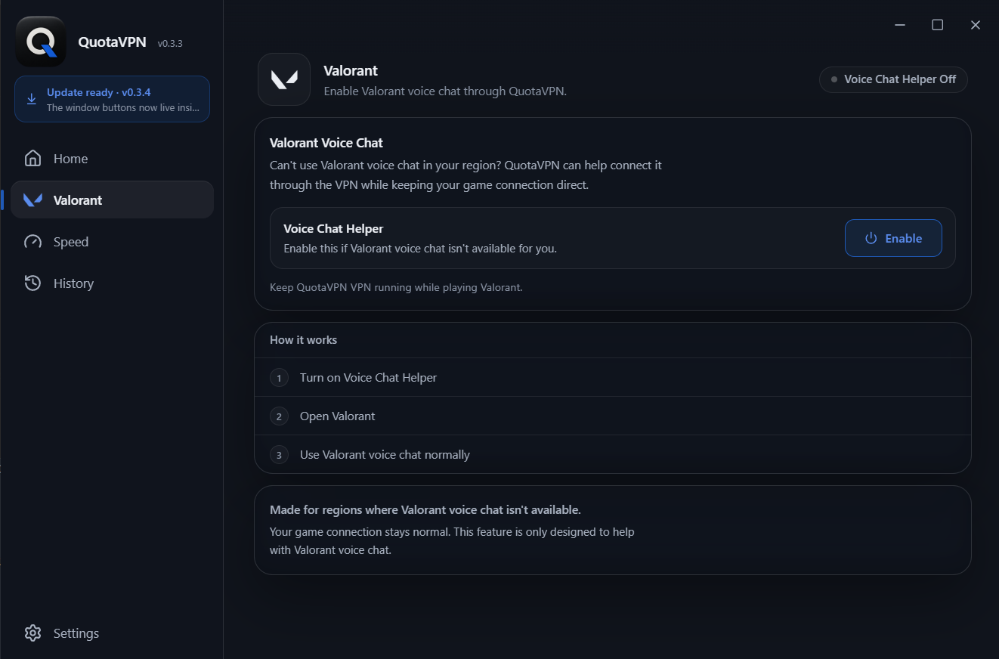

<h1 align="center">QuotaVPN</h1>

A VPN for Windows and Android that bills your traffic to the data package you pick. Gaming package, streaming package, or general quota: you choose per connection.

  <a href="https://github.com/YousefMohiey/QuotaVPN/releases/latest"><b>Download</b></a>
  &nbsp;&nbsp;&nbsp;
  <a href="https://quotavpn.app/">Website</a>
  &nbsp;&nbsp;&nbsp;
  <a href="https://quotavpn.app/app/">Windows demo</a>
  &nbsp;&nbsp;&nbsp;
  <a href="https://quotavpn.app/phone/">Android demo</a>

  
  
  
  
  

## The idea in thirty seconds

Some ISPs sell separate quota buckets: a gaming package, a streaming package, and a general pool. They sort each connection into a bucket by reading the server name in the TLS handshake at the start of the connection.

QuotaVPN puts the server name of the package you chose into that handshake. Pick a Gamerz card and the session bills to your gaming package. Pick a Streamerz card and it bills to streaming. That is the whole product.

## Screens

| Valorant voice chat | Server list | Arabic interface |
|---|---|---|
|  |  |  |

Windows app shown. The Android app uses the same theme and the same two packages; try it live in the [Android demo](https://quotavpn.app/phone/).

## What the app does

- **Two packages, Gamerz and Streamerz.** Each has its own server list (EA, Riot, Steam, YouTube, Meta, Prime Video and more), plus any custom server name you add.
- **Three transports, labelled honestly.** Standard keeps the package quota. WireGuard and Hysteria2 spend general quota and are the raw-speed options.
- **Per-app routing on both platforms.** Whole device, only these apps, or everything except them.
- **Valorant voice chat helper.** If voice chat is blocked in your region, one switch moves the voice traffic through the VPN and leaves your match connection direct.
- **Speed screen.** Ping, download and upload against your own server, with history.
- **English and Arabic, both apps.** Same layout in both languages; nothing mirrors.
- **Self-updating.** Windows installs new releases by itself. Android checks from Settings, downloads, and asks for one confirm tap.

## How each transport counts

| Mode | Transport | Bills to |
|------|-----------|----------|
| Standard | VLESS on TCP 443, with the package server name in the handshake | Your package (Gamerz / Streamerz) |
| WireGuard | Raw UDP, no TLS handshake for the ISP to read | General quota |
| Hysteria2 | UDP 443 with the same server name | General quota (ISPs read the name off TCP only) |

## Install

**Windows**

1. Download the setup from the [latest release](https://github.com/YousefMohiey/QuotaVPN/releases/latest).
2. Run it. It installs for the current user, no admin rights needed.
3. Open QuotaVPN and connect.

**Android**

1. Download the APK from the [latest release](https://github.com/YousefMohiey/QuotaVPN/releases/latest).
2. Open it to install (your phone will ask you to allow this install).
3. Open QuotaVPN and connect.

One note: the installers are not code-signed yet, so Windows SmartScreen warns about an unknown publisher on first run. Choose **More info**, then **Run anyway**.

## Trust

QuotaVPN is free and open source under the MIT license. No account, no tracking dashboards, nothing to sign up for. Windows verifies each release before installing it. Found a vulnerability? Please report it privately, not via a public issue: [SECURITY.md](SECURITY.md).

## License

MIT, see [LICENSE](LICENSE). Built by Yousef Mohiey.
